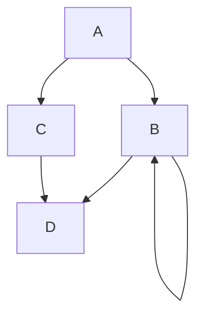
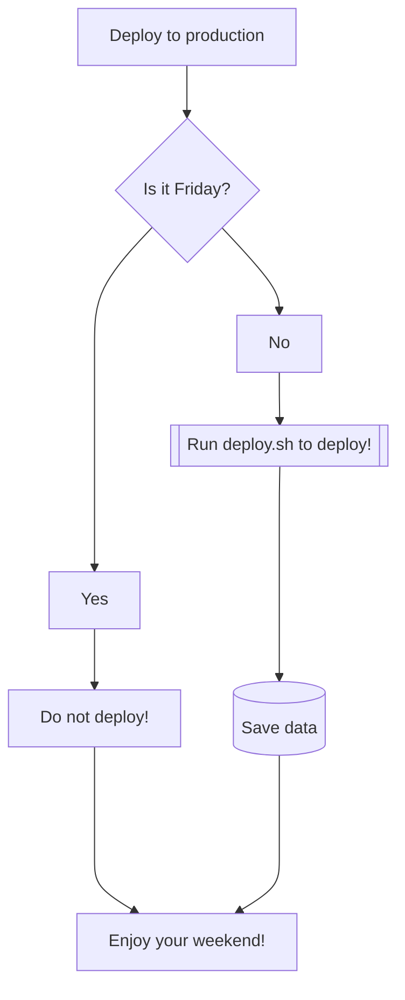
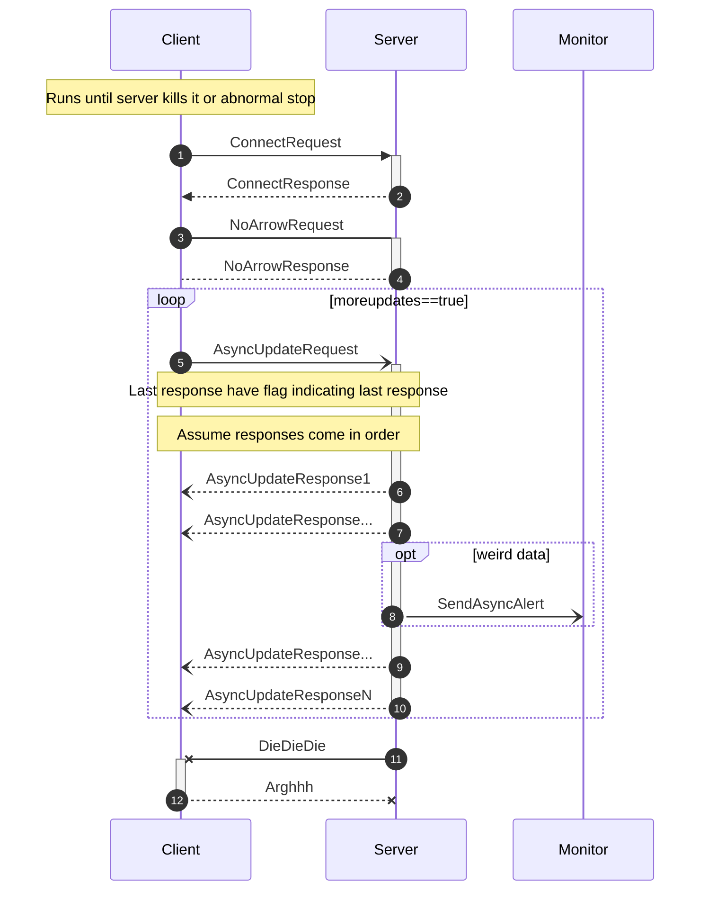

* Mermaid available in GitHub

Testing if mermaid works as stated in github markdown:

Two samples:

```mermaid
  graph TD;
      A-->B;
      B-->B;
      A-->C;
      B-->D;
      C-->D;
```

```mermaid
  flowchart TD;
    A[Deploy to production]-->B{Is it Friday?};
    B-->Yes--> C[Do not deploy!];
    B-->No-->D[[Run deploy.sh to deploy!]];
    C---->E[Enjoy your weekend!];
    D---->DB[(Save data)];
    DB---->E[Enjoy your weekend!];
```

```mermaid
  sequenceDiagram
  autonumber
    Note over Client: Runs until server kills it or abnormal stop
    Client->>+Server:ConnectRequest
    Server-->>-Client:ConnectResponse
    Client->+Server:NoArrowRequest
    Server-->-Client:NoArrowResponse
    loop moreupdates==true
    Client-)+Server:AsyncUpdateRequest
    Note over Client,Server: Last response have flag indicating last response
    Note over Client,Server: Assume responses come in order
    Server--)Client:AsyncUpdateResponse1
    Server--)Client:AsyncUpdateResponse...
    opt weird data
       Server-)Monitor:SendAsyncAlert
    end
    Server--)Client:AsyncUpdateResponse...
    Server--)-Client:AsyncUpdateResponseN
    end
    Server-x+Client:DieDieDie
    Client--x-Server:Arghhh
```
